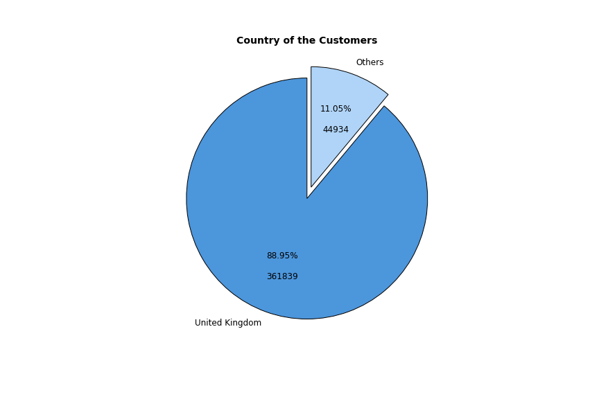

# Overall Business Result

## Chosen Model: Hierachical Cluster
**Date:** 18/10/2022

 

**Avarage Sales per Customer**: 
**Best Month avarage Selling:** 
**Best Week avarage Selling:** 

 

### Overall Client Rank

 

The choice of this number is due much more to adapting to the already known RFM table than the number of clusters that the algorithm performed better. 

### Most Purchased Items
***

