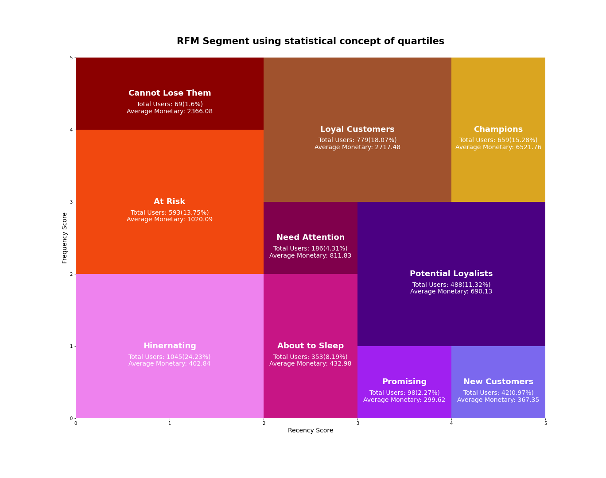

# Model Performace

## Chosen Model: Hierachical Cluster

**Date:** 18/10/2022

**Total Features** 3 
**Number of Features Used:** 3 
**Features:** GrossRevenueTotal, RecencyDays, Frequency 
**Framework:** scipy 
**Parameters**
Method: ward
Metric(distance): Euclidean
Criterion: Maxclust  

**Estimator:**  scipy.cluster.hierarchy.linkage(X, 'ward', metric='euclidean') , scipy.cluster.hierarchy.fcluster(model, k, criterion='maxclust')                      

**Evaluating Metrics:** Dendogram, Silhouette Score 
**Dimensionality Reduction:** UMAP, 2 
**Embedding:** No 

**Number of Clusters:** 10 
The choice of this number is due much more to adapting to the already known RFM table than the number of clusters that the algorithm performed better. 

***

### Chosen Model: Analysis

The hierarchical Clustering model performed especially well at the extremes of the RFM metrics, it segmented the "good outliers" well and these are critical points in the business world as the most difficult decisions are made on top of them.

The points considered critical were "Champions", "New Customers", "Cannot Lose Them". 

"Champions" must be a special group of customers who buy much more than other customers, this cluster could not be too generic to the point of grouping many customers, nor too specific to the point of not being replicable for new aspirants in the future or being exclusive too much for these customers.

 Most of a company's action plans are in relation to new customers, so it is essential that the machine learning model identifies this group, the hierarchical cluster did this very well considering users who performed approximately one to two purchases within a week from a new customer.

 "Can not Lose Them" are those who have already purchased a lot from the company but have not purchased anything for sometime. This is also another group that has a constant action plan from the business team because they want to know how to identify the reasons that lead this customer to leave and bring him back. "The hierarchical cluster possibly performed worse here because it has a lot of similarity with the "At Risk" and "Loyal Customers" those cluster are very close to each other.

 ### Comparing the Machine Learning Model with Statistic RFM model segment

Modelo RFM estatistico
**Vantagens** 

- Simples de entender
- Simples de explicar para qualquer pessoa
- Simples de implementar
- Já é conhecido e utilizado a mais tempo o que gera

**Desvantagens**

- Muitas vezes é muito genérico, por utiliza apenas duas variaveis, recencia e frequencia, para montar tabela
- Não trata diretamente a varaviel mais importante que é a monetização.

- Não é escalavel, o modelo não muda apartir da inserção/exclusão de variaveis
- Não possuí desempho tão bom nas mais altas frequencias e recencias

Modelo de Machine Learning
**Vantagens** 

- Consegue ser especifico, por utilizar multiplas variaveis, encontrando grupos/padrões muitas vezes pouco visíveis.
- Atribuí pesos para cada variavel(a maneira varia de acordo com cada algoritimo), dessa forma cada variável possuí uma explicabilidade para formar a tabela final.
- É escalavel, o modelo pode performar mais ou menos a partir da inserção/exclusão de variaveis ou até mesmo 
- Existem algoritimos/configurações que permitem com que modelos desempenhem bem em qualquer frequencia e recencia

**Desvantagens**
- Muitas vezes é difícil entender seu "modus operandi"
- Muitas vezes é difícil de explicar para o time de negócios
- Modelos de clusterização sempre encontram grupos mas nem sempre os grupos encontrados possuem um conhecimento de négocio relevante.

