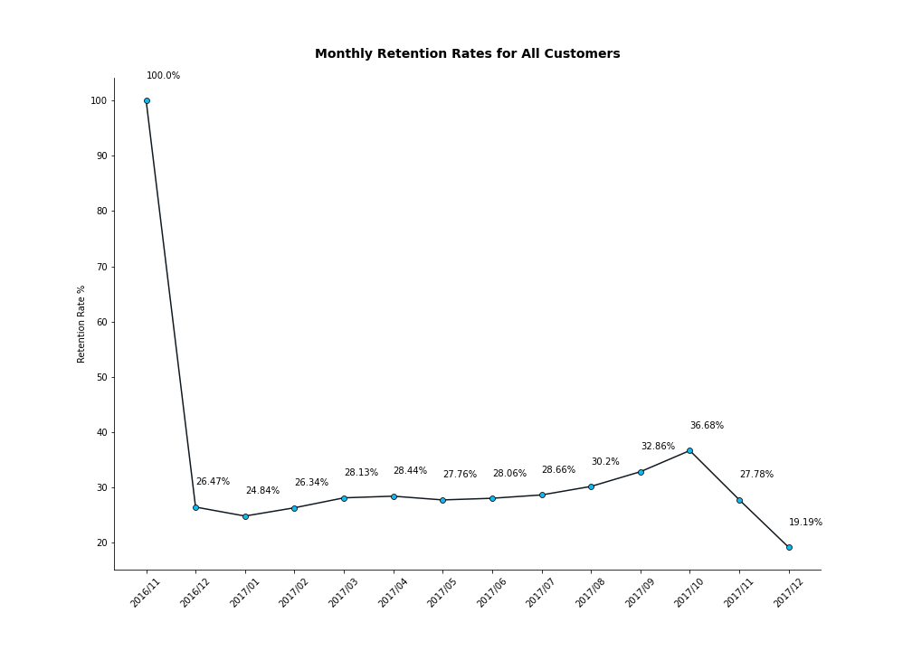
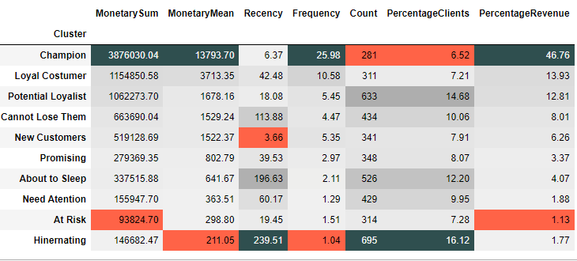
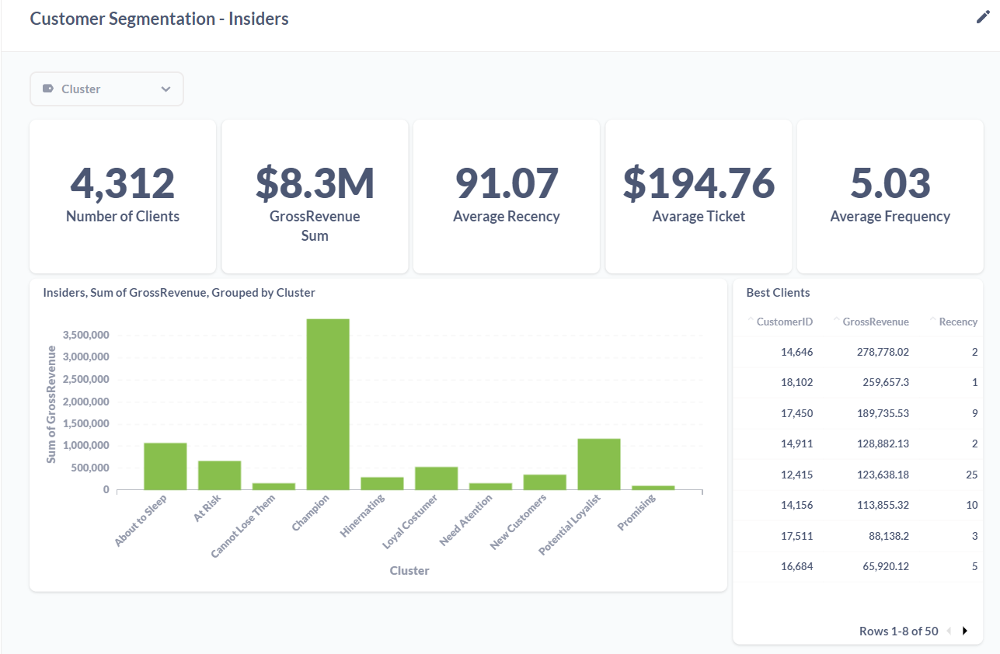

# Business Report - Loyalty Program

## Content

* Resume
* Rentention Analysis - Cohort
* RFM Table
* Q & A - Loyalty Program
* Dashboard

## Resume

* **Time length:** 2016/11/29 to 2017/12/07 
* **Total Invoices**: 21705 
* **Non Cancelled Invoices**: 18376 
* **Cancelled Invoices**: 3329 
* **Unique Customers:** 4363 
* **Uninformed Customers:** 135080 

## Rentention Analysis - Cohort

 

## Clusters

 

## RFM Table

## Q & A - Loyalty Program

**Who are the eligible people to participate in the Champions program?**

- The best customers to participate in the "Insiders" program are those customers who are great, but not yet the best. They are very profitable customers for the company and are often buying several products. The customers selected for this program are from the "Potencial Loyalits" Cluster.

**How many customers will be part of the loyalty group?**

- 488

**What are the main characteristics of these customers?** 

- They are one of the most profitable customers, who have been buying a lot in recent months. Despite being great customers, they are not the company's most profitable nor are they those with the greatest purchase history in the company in the last year.

**What is the percentage of revenue contribution that comes theses costumers?**

- A receita média desses clientes é de $690,13

**What are the conditions for a person to be eligible?**

- Provide a high gross revenue and have been buying a lot in recent months

**What actions can the marketing team take to increase sales?**

## Dashboard Metabase

