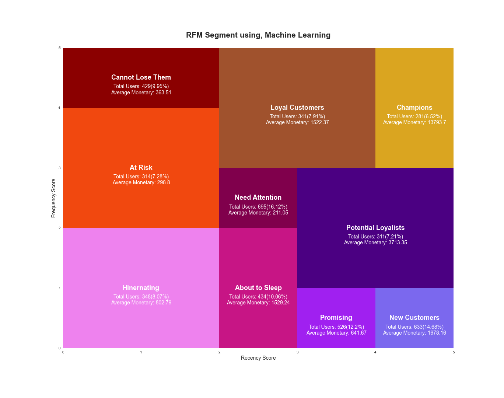

# Comparing the Machine Learning Model with Statistical Quartile RFM

## Background
Foram analisados 4316 clientes com os mais diversos perfis de consumo, e o objetivo é classificar os clientes de acordo esses perfis. Uma tabela já conhecida é a tabela RFM de segmentação onde nela os clientes são classificados como: 

### Modelo Estatistico 
**Vantagens** 

- Simples de entender
- Simples de explicar para qualquer pessoa
- Simples de implementar
- Já é conhecido e utilizado a mais tempo o que gera

**Desvantagens**

- Muitas vezes é muito genérico, por utiliza apenas duas variaveis, recencia e frequencia, para montar tabela
- Não trata diretamente a varaviel mais importante que é a monetização.

- Não é escalavel, o modelo não muda apartir da inserção/exclusão de variaveis
- Não possuí desempho tão bom nas mais altas frequencias e recencias

### Modelo de Machine Learning 
**Vantagens** 

- Consegue ser especifico, por utilizar multiplas variaveis, encontrando grupos/padrões muitas vezes pouco visíveis.
- Atribuí pesos para cada variavel(a maneira varia de acordo com cada algoritimo), dessa forma cada variável possuí uma explicabilidade para formar a tabela final.
- É escalavel, o modelo pode performar mais ou menos a partir da inserção/exclusão de variaveis ou até mesmo 
- Existem algoritimos/configurações que permitem com que modelos desempenhem bem em qualquer frequencia e recencia

**Desvantagens**
- Muitas vezes é difícil entender seu "modus operandi"
- Muitas vezes é difícil de explicar para o time de negócios
- Modelos de clusterização sempre encontram grupos mas nem sempre os grupos encontrados possuem um conhecimento de négocio relevante.

